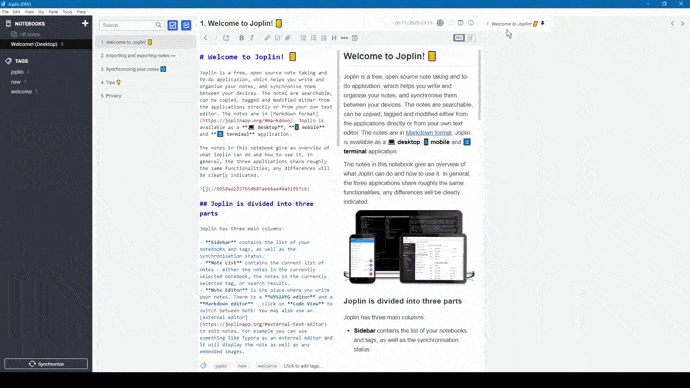
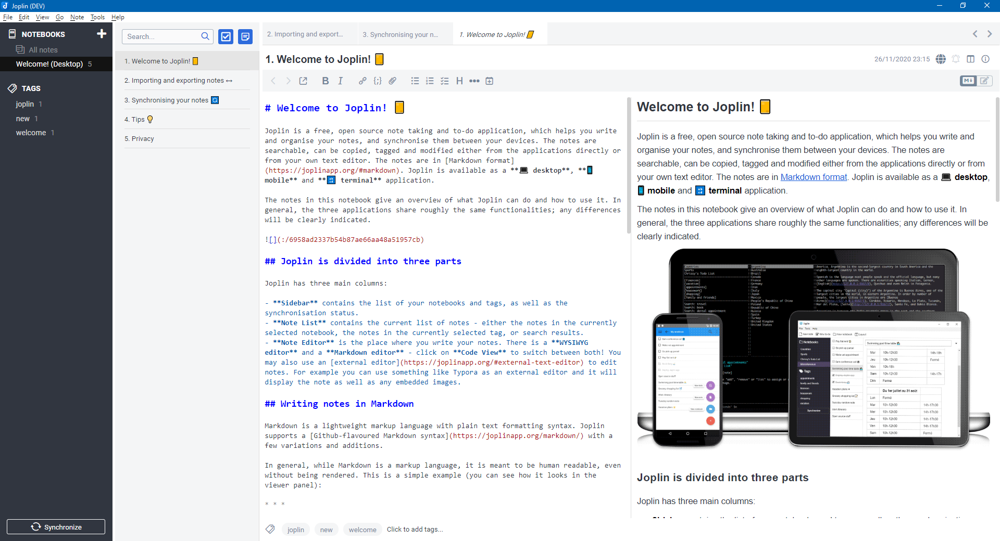
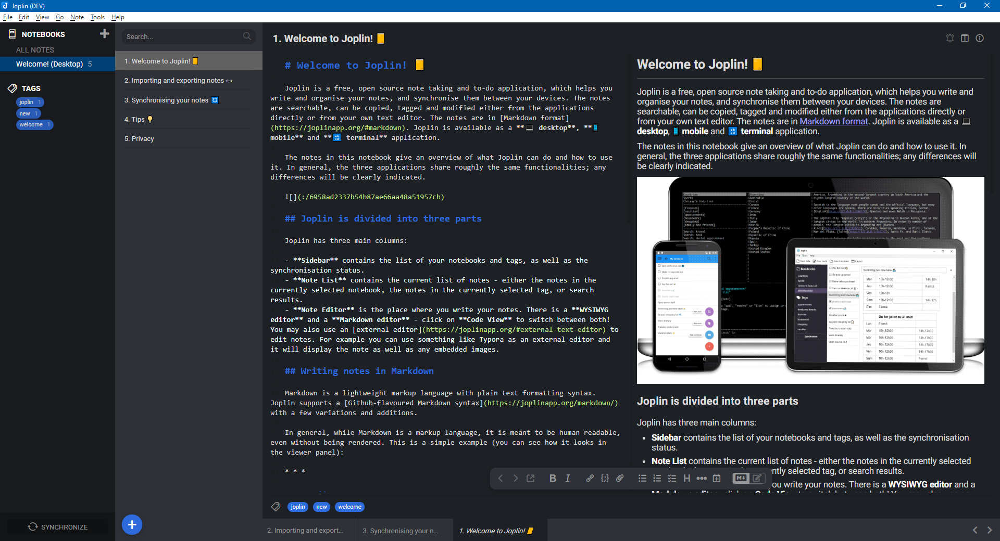
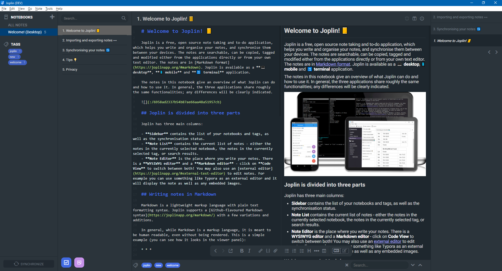

# Joplin Favorites

Joplin Favorites is a plugin to extend the UX and UI of [Joplin's](https://joplinapp.org/) desktop application.

It allows to add any notebook, note, to-do or tag to a favorites panel to access them quickly.

> :warning: **CAUTION** - Requires Joplin **v1.6.5** or newer

## Table of contents

- [Features](#features)
  - [Screenshots](#screenshots)
- [Commands](#Commands)
- [User options](#user-options)
- [Installation](#installation)
- [Uninstallation](#uninstallation)
- [Feedback](#feedback)
- [Support](#support)
- [Development](#development)
- [Changes](#changes)
- [License](#license)

## Features

// TODO
- Add any of the following item types to a favorites panel
  - Notebook (Folder)
  - Note/to-do
  - Tag
  - Search query (currently not supported - hopefully added later)
- Set and edit names of the favorites
- Change position of favorites within the panel via drag & drop
- [Configurable](#user-options) style attributes
- Support horizontal and vertical layout



### Screenshots

// TODO siehe assets ordner
#### Favorites above note content



### Tabs below note content



> **NOTE** - The used UI theme on this screenshot can be downloaded [here](https://github.com/benji300/joplin-wanaka-ui).

### Tabs beside note content (vertical layout)



> **NOTE** - The used UI theme on this screenshot can be downloaded [here](https://github.com/benji300/joplin-milford-ui).

## Commands

This plugin provides additional commands as described in the following table.

// TODO add commands
| Command Label                   | Command ID             | Description                                                                                   | Menu contexts                                   |
| ------------------------------- | ---------------------- | --------------------------------------------------------------------------------------------- | ----------------------------------------------- |
| Tabs: Pin note                  | `tabsPinNote`          | Pin selected note(s) to the tabs.                                                             | `Tools>Tabs`, `NoteListContext`,`EditorContext` |
| Tabs: Unpin note                | `tabsUnpinNote`        | Unpin selected note(s) from the tabs.                                                         | `Tools>Tabs`                                    |
| Tabs: Switch to last active tab | `tabsSwitchLastActive` | Switch to the last active tab, i.e. to previous selected note.                                | `Tools>Tabs`                                    |
| Tabs: Switch to left tab        | `tabsSwitchLeft`       | Switch to the left tab next to the active, i.e. select the left note.                         | `Tools>Tabs`                                    |
| Tabs: Switch to right tab       | `tabsSwitchRight`      | Switch to the right tab next to the active, i.e. select the right note.                       | `Tools>Tabs`                                    |
| Tabs: Move tab left             | `tabsMoveLeft`         | Move active tab one position to the left.                                                     | `Tools>Tabs`                                    |
| Tabs: Move tab right            | `tabsMoveRight`        | Move active tab one position to the right.                                                    | `Tools>Tabs`                                    |
| Tabs: Remove all pinned tabs    | `tabsClear`            | Remove all pinned tabs. In case no note is selected, the tabs list might be empty afterwards. | `Tools>Tabs`                                    |

> **NOTE** - Keyboard shortcuts can be assigned in user options via `Tools > Options > Keyboard Shortcuts`. Search for the command label where shortcuts shall be added.

> **NOTE** - All commands can also be accessed via the `Command palette`.

## User options

This plugin adds provides user options which can be changed via `Tools > Options > Favorites`.

> **NOTE** - If `default` is set for an advanced style setting, the corresponding default color, font family, etc. will be used to match the common App look.

> **NOTE** - In case color settings shall be overwritten, they must be specified as valid CSS attribute values, e.g. `#ffffff`, `rgb(255,255,255)`, etc.

## Installation

### Joplin v1.6.4 and newer

- Open Joplin and navigate to `Tools > Options > Plugins`
- Search for `favorites` and press install
- Restart Joplin to enable the plugin

### Joplin v1.6.2 and previous

- Download the latest released JPL package (`joplin.plugin.benji.favorites.jpl`) from [here](https://github.com/benji300/joplin-favorites/releases)
- Open Joplin and navigate to `Tools > Options > Plugins`
- Press `Install plugin` and select the previously downloaded `jpl` file
- Confirm selection
- Restart Joplin to enable the plugin

### Place panel

By default the panel will be on the right side of the screen, this can be adjusted by:

- `View > Change application layout`
- Use the arrow keys (the displayed ones, not keyboard keys) to move the panel at the desired position
- Move the splitter to reach the desired height/width of the panel
- Press `ESC` to save the layout and return to normal mode

## Uninstallation

- Open Joplin
- Navigate to `Tools > Options > Plugins`
- Search for the `Note Tabs` plugin
- Press `Delete` to remove the plugin from the user profile directory
  - Alternatively you can also disable the plugin by clicking on the toggle button
- Restart Joplin

## Feedback

- :question: Need help?
  - Ask a question on the [Joplin Forum](https://discourse.joplinapp.org/t/plugin-note-tabs/12752)
- :bulb: An idea to improve or enhance the plugin?
  - Start a new discussion on the [Forum](https://discourse.joplinapp.org/t/plugin-note-tabs/12752) or upvote [popular feature requests](https://github.com/benji300/joplin-note-tabs/issues?q=is%3Aissue+is%3Aopen+label%3Aenhancement+sort%3Areactions-%2B1-desc+)
- :bug: Found a bug?
  - Check the [Forum](https://discourse.joplinapp.org/t/plugin-note-tabs/12752) if anyone else already reported the same issue. Otherwise report it by yourself.

## Support

You like this plugin as much as I do and it helps you in your daily work with Joplin?

Then I would be very happy if you would buy me a beer via [PayPal](https://www.paypal.com/donate?hosted_button_id=6FHDGK3PTNU22) :wink::beer:

## Development

### Building the plugin

If you want to build the plugin by your own simply run:

```
npm run dist
```

## Changes

See [CHANGELOG](./CHANGELOG.md) for details.

## License

Copyright (c) 2021 Benjamin Seifert

MIT License. See [LICENSE](./LICENSE) for more information.
