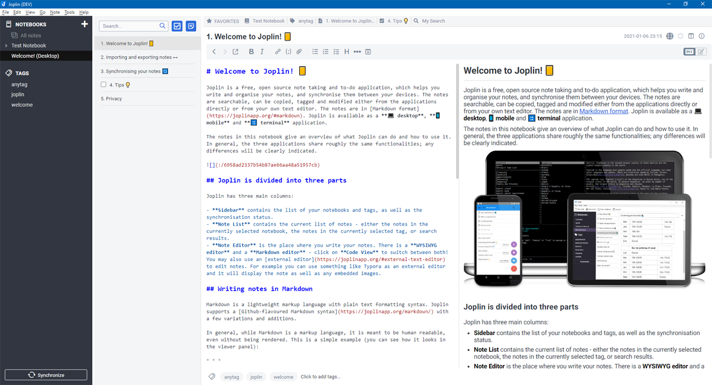
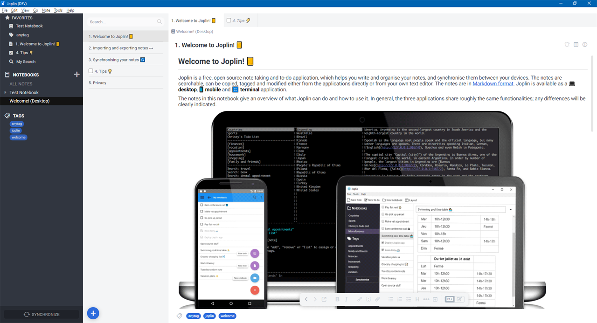

# Joplin Favorites

Joplin Favorites is a plugin to extend the UX and UI of [Joplin's](https://joplinapp.org/) desktop application.

It allows to save any notebook, note, to-do, tag, or search as favorite in an extra panel view for quick access.

> :warning: **CAUTION** - Requires Joplin **v1.6.5** or newer

## Table of contents

- [Features](#features)
  - [Screenshots](#screenshots)
- [How to use](#how-to-use)
  - [Place the panel](#place-the-panel)
  - [Add favorite](#add-favorite)
  - [Edit favorite](#edit-favorite)
  - [Remove favorite](#remove-favorite)
  - [Open saved searches](#open-saved-searches)
- [Commands](#Commands)
- [User options](#user-options)
- [Installation](#installation)
- [Uninstallation](#uninstallation)
- [Feedback](#feedback)
- [Support](#support)
- [Development](#development)
- [Changes](#changes)
- [License](#license)

## Features

- Save any of the following item types as favorites
  - Notebook
  - Note, To-do
  - Tag
  - Search
    - Not fully supported right now - see [here](#open-saved-searches) for details
- Set and edit user defined names for the favorites
- Right-click on favorites to edit or remove
- Change position of favorites within the panel via drag & drop
- [Drag notebooks and notes](#how-to-use) from sidebar or note list directly to favorites
- [Configurable](#user-options) style attributes
- Support horizontal and vertical layout

### Screenshots

#### Favorites above note content



### Favorites in sidebar (vertical layout)



> **NOTE** - The used UI theme on this screenshot can be downloaded [here](https://github.com/benji300/joplin-wanaka-ui).

## How to use

### Place the panel

By default the panel will be on the right side of the screen, this can be adjusted by:

- `View > Change application layout`
- Use the arrow keys (the displayed ones, not keyboard keys) to move the panel at the desired position
- Move the splitter to reach the desired height/width of the panel
- Press `ESC` to save the layout and return to normal mode

### Add favorite

// TODO describe how to add favorites
// add via context menu
// Drag notebooks and notes from sidebar or note list onto 'FAVORITES' title to add

### Edit favorite

// TODO describe how to edit or remove a favorite
// righ-click on favorite

// TODO screenshot of edit dialog

### Remove favorite

- Right click on one of the favorites to open the edit dialog
- Press `Delete` on the dialog to remove the favorite

Alternatively you can also remove all favorites at once via the `Favorites: Remove all favorites` [command](#commands).

### Open saved searches

Currently favorites for searches are not fully supported. Due to restrictions of the App it is not possible to open the global search with a handled search query.
To open a saved search follow this workaround:

- Save your search via the `Favorites: Add search` command
- You can enter a name and the search query in the dialog
- Click on the search favorite to copy its query to the clipboard
- This will also set the focus to the global search bar
- Paste the clipboard content to the search bar and press `Enter`

## Commands

This plugin provides additional commands as described in the following table.

| Command Label                   | Command ID             | Description                            | Menu contexts                                    |
| ------------------------------- | ---------------------- | -------------------------------------- | ------------------------------------------------ |
| Favorites: Add notebook         | `favsAddFolder`        | Add favorite for selected notebook     | `Tools>Favs`, `FolderContext`                    |
| Favorites: Add note             | `favsAddNote`          | Add favorite for selected note(s)      | `Tools>Favs`, `NoteListContext`, `EditorContext` |
| Favorites: Add tag              | `favsAddTag`           | Add favorite for selected tag          | `Tools>Favs`, `TagContext`                       |
| Favorites: Add search           | `favsAddSearch`        | Add favorite with entered search query | `Tools>Favs`                                     |
| Favorites: Remove all favorites | `favsClear`            | Remove all favorites                   | `Tools>Favs`                                     |
| Favorites: Toggle visibility    | `favsToggleVisibility` | Toggle panel visibility                | `Tools>Favs`                                     |

> **NOTE** - Keyboard shortcuts can be assigned in user options via `Tools > Options > Keyboard Shortcuts`. Search for the command label where shortcuts shall be added.

> **NOTE** - All commands can also be accessed via the `Command palette`.

## User options

This plugin adds provides user options which can be changed via `Tools > Options > Favorites`.

> **NOTE** - If `default` is set for an advanced style setting, the corresponding default color, font family, etc. will be used to match the common App look.

> **NOTE** - In case color settings shall be overwritten, they must be specified as valid CSS attribute values, e.g. `#ffffff`, `rgb(255,255,255)`, etc.

## Installation

### Joplin v1.6.4 and newer

- Open Joplin and navigate to `Tools > Options > Plugins`
- Search for `favorites` and press install
- Restart Joplin to enable the plugin
- By default the panel will appear on the right side of the screen
  - See here to [place the panel](#place-the-panel)

### Joplin v1.6.2 and previous

- Download the latest released JPL package (`joplin.plugin.benji.favorites.jpl`) from [here](https://github.com/benji300/joplin-favorites/releases)
- Open Joplin and navigate to `Tools > Options > Plugins`
- Press `Install plugin` and select the previously downloaded `jpl` file
- Confirm selection
- Restart Joplin to enable the plugin
- By default the panel will appear on the right side of the screen
  - See here to [place the panel](#place-the-panel)

## Uninstallation

- Open Joplin
- Navigate to `Tools > Options > Plugins`
- Search for the `Favorites` plugin
- Press `Delete` to remove the plugin completely
  - Alternatively you can also disable the plugin by clicking on the toggle button
- Restart Joplin

## Feedback

// TODO replace with concrete thread links

- :question: Need help?
  - Ask a question on the [Joplin Forum](https://discourse.joplinapp.org/)
- :bulb: An idea to improve or enhance the plugin?
  - Start a new discussion on the [Forum](https://discourse.joplinapp.org/) or upvote [popular feature requests](https://github.com/benji300/joplin-favorites/issues?q=is%3Aissue+is%3Aopen+label%3Aenhancement+sort%3Areactions-%2B1-desc+)
- :bug: Found a bug?
  - Check the [Forum](https://discourse.joplinapp.org/) if anyone else already reported the same issue. Otherwise report it by yourself.

## Support

You like this plugin as much as I do and it helps you in your daily work with Joplin?

Then I would be very happy if you would buy me a beer via [PayPal](https://www.paypal.com/donate?hosted_button_id=6FHDGK3PTNU22) :wink::beer:

## Development

### Building the plugin

If you want to build the plugin by your own simply run:

```
npm run dist
```

The npm package of the plugin can be found [here](https://www.npmjs.com/package/joplin-plugin-benji-favorites).

## Changes

See [CHANGELOG](./CHANGELOG.md) for details.

## License

Copyright (c) 2021 Benjamin Seifert

MIT License. See [LICENSE](./LICENSE) for more information.
