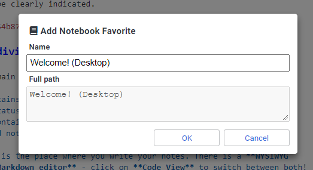
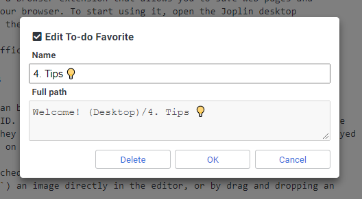
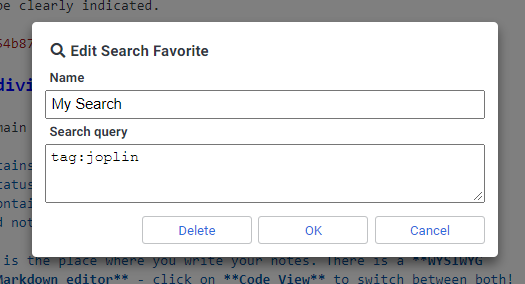

# Joplin Favorites

Joplin Favorites is a plugin to extend the UX and UI of [Joplin's](https://joplinapp.org/) desktop application.

It allows to save any notebook, note, to-do, tag, or search as favorite in an extra panel view for quick access.

> :warning: **CAUTION** - Requires Joplin **v1.6.5** or newer

## Table of contents

- [Features](#features)
  - [Screenshots](#screenshots)
- [Installation](#installation)
- [Usage](#usage)
  - [Place the panel](#place-the-panel)
  - [Add favorite](#add-favorite)
  - [Edit favorite](#edit-favorite)
  - [Remove favorite](#remove-favorite)
  - [Open saved search](#open-saved-search)
- [Commands](#Commands)
  - [Keyboard shortcuts](#keyboard-shortcuts)
- [User options](#user-options)
- [Feedback](#feedback)
- [Support](#support)
- [Development](#development)
- [Changes](#changes)
- [License](#license)

## Features

- Save any of the following item types as favorites
  - Notebook
  - Note, To-do
  - Tag
  - Search
    - Not fully supported right now - see [here](#open-saved-search) for details
- Set and edit user defined names for the favorites
- Right-click on favorites to edit or remove
- Change position of favorites within the panel via drag & drop
- Drag notebooks and notes from sidebar or note list directly to favorites
- Configurable style attributes
- Support horizontal and vertical layout
- Toggle panel visibility

### Screenshots

#### Favorites above note content

#### Favorites in sidebar (vertical layout)

> **NOTE** - The used UI theme on this screenshot can be downloaded [here](https://github.com/benji300/joplin-wanaka-ui).

## Installation

### Automatic (Joplin v1.6.4 and newer)

- Open Joplin and navigate to `Tools > Options > Plugins`
- Search for `favorites` and press install
- Restart Joplin to enable the plugin
- By default the panel will appear on the right side of the screen, see how to [place the panel](#place-the-panel)

### Manual

- Download the latest released JPL package (`*.jpl`) from [here](https://github.com/benji300/joplin-favorites/releases)
- Open Joplin and navigate to `Tools > Options > Plugins`
- Press `Install plugin` and select the previously downloaded `jpl` file
- Confirm selection
- Restart Joplin to enable the plugin
- By default the panel will appear on the right side of the screen, see how to [place the panel](#place-the-panel)

### Uninstall

- Open Joplin and navigate to `Tools > Options > Plugins`
- Search for the `Favorites` plugin
- Press `Delete` to remove the plugin completely
  - Alternatively you can also disable the plugin by clicking on the toggle button
- Restart Joplin

## Usage

### Place the panel

By default the panel will be on the right side of the screen, this can be adjusted by:

- `View > Change application layout`
- Use the arrow keys (the displayed ones, not keyboard keys) to move the panel at the desired position
- Move the splitter to reach the desired height/width of the panel
- Press `ESC` to save the layout and return to normal mode

### Add favorite

- To add a new favorite to the panel, you have to trigger the corresponding [command](#commands)
  - In the table you can see also from which menu context the commands can be triggered
- Notebooks, notes and to-dos can also be added via drag & drop the selected entries onto the `FAVORITES` title of the panel
  - To enable this feature, the option `Show favorites panel title` must be enabled

The `Edit favorite before add` option lets you choose whether or not to edit the name before adding a new favorite.

- This is not supported when adding multiple selected notes
- For searches the dialog is always opened to enter the search query

### Edit favorite

- Right click on one of the favorites to open the edit dialog

In the edit dialog you can change the name of any favorite.

For searches, you can also edit the search query.

### Remove favorite

- Right click on one of the favorites to open the edit dialog (see screenshots above)
- Press `Delete` to remove the favorite

Alternatively you can remove all favorites at once via the `Favorites: Remove all favorites` command.

### Open saved search

Currently favorites for searches are not fully supported. Due to restrictions of the App it is not possible to open the global search with a handled search query.
To open a saved search follow this workaround:

- Save your search via the `Favorites: Add search` command
- You can enter a name and the search query in the dialog
- Click on the search favorite to copy its query to the clipboard
- This will also set the focus to the global search bar
- Paste the clipboard content to the search bar and press `Enter`

## Commands

This plugin provides additional commands as described in the following table.

| Command Label                   | Command ID             | Description                            | Menu contexts                                                            |
| ------------------------------- | ---------------------- | -------------------------------------- | ------------------------------------------------------------------------ |
| Favorites: Add notebook         | `favsAddFolder`        | Add favorite for selected notebook     | `Tools>Favorites`, `FolderContext`, `Command palette`                    |
| Favorites: Add note             | `favsAddNote`          | Add favorite for selected note(s)      | `Tools>Favorites`, `NoteListContext`, `EditorContext`, `Command palette` |
| Favorites: Add tag              | `favsAddTag`           | Add favorite for selected tag          | `TagContext`                                                             |
| Favorites: Add search           | `favsAddSearch`        | Add favorite with entered search query | `Tools>Favorites`, `Command palette`                                     |
| Favorites: Remove all favorites | `favsClear`            | Remove all favorites                   | `Tools>Favorites`, `Command palette`                                     |
| Favorites: Toggle visibility    | `favsToggleVisibility` | Toggle panel visibility                | `Tools>Favorites`, `Command palette`                                     |

### Keyboard shortcuts

Keyboard shortcuts can be assigned in user options via `Tools > Options > Keyboard Shortcuts` to all [commands](#commands) which are assigned to the `Tools>Favorites` menu context.
In the keyboard shortcut editor, search for the command label where shortcuts shall be added.

## User options

This plugin adds provides user options which can be changed via `Tools > Options > Favorites`.

> **NOTE** - If `default` is set for an advanced style setting, the corresponding default color, font family, etc. will be used to match the common App look.

> **NOTE** - In case color settings shall be overwritten, they must be specified as valid CSS attribute values, e.g. `#ffffff`, `rgb(255,255,255)`, etc.

## Feedback

- :question: Need help?
  - Ask a question on the [Joplin Forum](https://discourse.joplinapp.org/t/notebook-note-to-do-tag-search-favorites-plugin/14049)
- :bulb: An idea to improve or enhance the plugin?
  - Start a new discussion on the [Forum](https://discourse.joplinapp.org/t/notebook-note-to-do-tag-search-favorites-plugin/14049) or upvote [popular feature requests](https://github.com/benji300/joplin-favorites/issues?q=is%3Aissue+is%3Aopen+label%3Aenhancement+sort%3Areactions-%2B1-desc+)
- :bug: Found a bug?
  - Check the [Forum](https://discourse.joplinapp.org/t/notebook-note-to-do-tag-search-favorites-plugin/14049) if anyone else already reported the same issue. Otherwise report it by yourself.

## Support

You like this plugin as much as I do and it improves your daily work with Joplin?

Then I would be very happy if you buy me a beer via [PayPal](https://www.paypal.com/donate?hosted_button_id=6FHDGK3PTNU22) :wink::beer:

## Development

The npm package of the plugin can be found [here](https://www.npmjs.com/package/joplin-plugin-benji-favorites).

### Building the plugin

If you want to build the plugin by your own simply run `npm run dist`.

### Updating the plugin framework

To update the plugin framework, run `npm run update`.

## Changes

See [CHANGELOG](./CHANGELOG.md) for details.

## License

Copyright (c) 2021 Benjamin Seifert

MIT License. See [LICENSE](./LICENSE) for more information.
